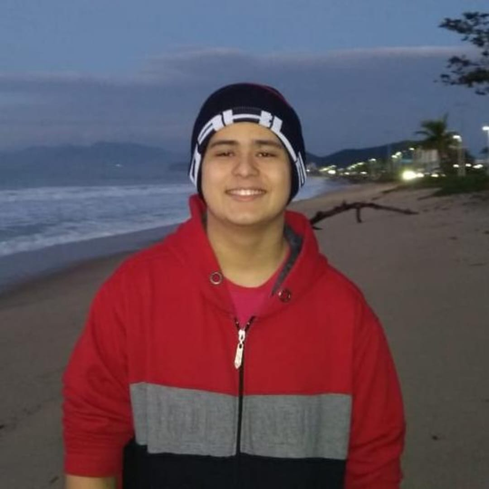

# portfolio_digital_dsm

## Apresentação
Nome: Fábio Kenjy Sato Lucas
Idade: 20 anos
Curso: Desenvolvimento de Software Multiplataforma - FATEC prof° Jessen Vidal
Cargo atual: Educador - AJAS (Ensinar sobre tecnologia e robótica para ensino fundamental)
Cargo almejado: Desenvolvedor front-end JR.

## 🛠 Tecnologias usadas e também que serão usadas futuramente
- GitHub;
- HTML;
- CSS;
- Bootstrap.

## Como clonar esse projeto
1° Passo: Crie uma pasta gerenciada pelo git
 
2° Passo: Use o comando git clone (nome do repositório)
 
3° Passo: Verificar Se o repositório está clonado no seu repositório local
 
... (Projeto ainda não finalizado, mais informações em breve
